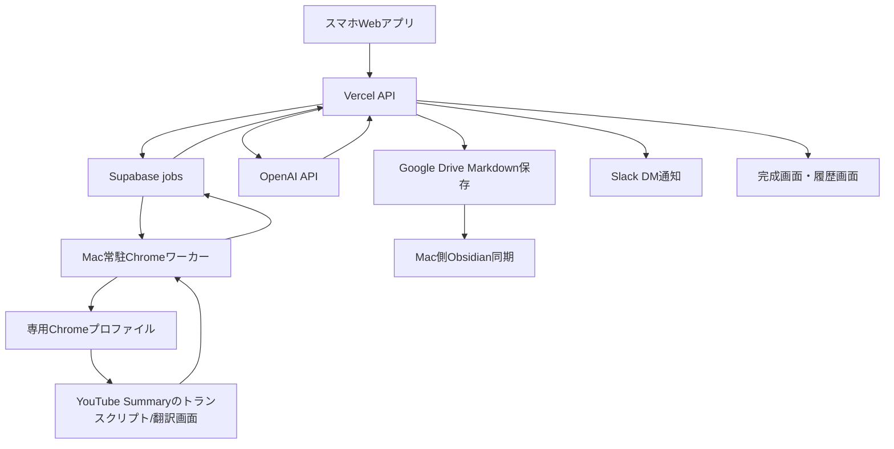

# YouTube経営実践コンテンツ化アプリ 仕様書

作成日: 2026-07-08  
対象: 自分専用のスマホ対応Webアプリ  
配置: Vercel + Supabase + Mac常駐Chromeワーカー

## 1. 結論

YouTubeリンクをスマホから貼り付けると、Mac上の専用Chromeプロファイルを自動操作してYouTube Summaryのトランスクリプト/翻訳を取得し、OpenAI APIで中小企業向けの経営実践レポートとSNS別原稿を生成する。

生成結果は1動画につき1つのMarkdownとしてGoogle Driveに保存し、Mac側でObsidianへ同期する。アプリ上では履歴検索、完成画面の再表示、媒体別コピーボタンを使えるようにする。

## 2. 決定済み方針

- 利用者は自分のみ。
- スマホから外出先でも使えるWebアプリにする。
- Vercelに公開し、Googleログインで自分のGoogleアカウントだけを許可する。
- 履歴DBはSupabase Postgresを使う。
- AI生成はOpenAI APIを使う。
- 保存先はGoogle Driveを正本にし、Mac側でObsidianへ同期する。
- Slack通知は自分宛DMに送る。
- 1動画につき1つのMarkdownファイルを作る。
- ファイル名とH1は元動画タイトルではなく、要約した題材から作る実務寄りタイトルを使う。
- 初期版はYouTubeリンクを1本ずつ手動で貼り付けて処理する。
- 1日あたりの自動処理上限は10本。
- 60分以内の動画は通常処理、60分超は確認待ちにする。
- Chrome処理失敗時は初回1回 + リトライ最大2回、合計最大3回試行する。
- Chromeリトライでも失敗した場合はSlack DMで手動対応を依頼し、手動文字起こし貼り付けから再開する。

## 3. 全体構成



## 4. 文字起こし取得方式

### 4.1 主経路

初期版の主経路は、Mac上のChrome実画面を自動操作してYouTube Summary機能からトランスクリプト/翻訳を取得する方式にする。

処理手順:

1. スマホWebアプリにYouTube URLを貼る。
2. Vercel APIがSupabaseにジョブを作る。
3. Mac常駐ワーカーが未処理ジョブを検知する。
4. 専用ChromeプロファイルでChromeを起動する。
5. YouTube URLを開く。
6. YouTube Summary機能を開く。
7. トランスクリプト画面へ移動する。
8. 必要に応じて翻訳表示へ切り替える。
9. 表示された文字起こし/翻訳テキストを取得する。
10. 取得テキストをSupabaseへ戻す。
11. Vercel APIが要約・生成処理へ進む。

### 4.2 翻訳方針

- 日本語動画の場合は、トランスクリプトをそのまま使う。
- 日本語以外の動画の場合は、YouTube Summary側の翻訳表示を使い、日本語テキストを取得する。
- 翻訳表示が取れない場合は `manual_transcript_required` にする。
- 翻訳の品質に不安がある箇所は、本文で断定せず【要確認】に回す。

### 4.3 失敗時の扱い

Chrome処理失敗時:

1. 失敗理由をSupabaseに記録する。
2. 専用ChromeプロファイルのChromeを閉じる。
3. Chromeを再起動する。
4. YouTube URLを開き直す。
5. YouTube Summaryのトランスクリプト/翻訳画面まで再操作する。
6. 最大2回までリトライする。
7. それでも失敗したら `chrome_automation_failed` にする。
8. Slack DMで手動対応を通知する。
9. アプリの「手動文字起こし貼り付け」から再開できるようにする。

最大試行回数:

- 初回: 1回
- リトライ: 最大2回
- 合計: 最大3回

### 4.4 手動文字起こし再開

- Chrome処理が失敗した場合、ステータスを `manual_transcript_required` または `chrome_automation_failed` にする。
- Slack DMで自分に通知する。
- アプリ上に「手動文字起こしを貼り付けて再開」ボタンを表示する。
- 手動で貼り付けた文字起こしは、元の動画ID・出力モード・保存先を引き継いで処理する。
- 一括出力を選んでいた場合は、手動貼り付け後に一括出力を自動再開する。
- 個別出力を選んでいた場合は、選択済みの出力だけを自動再開する。

## 5. 文章生成ルール

### 5.1 絶対厳守: 勧誘・セールスの完全除外

投稿本文には以下を一切載せない。

- セミナー・講座・イベント・説明会・コミュニティ等への勧誘、申込・参加誘導
- セミナー勧誘・会員招待に伴う会費・料金・月額・入会金等の説明
- 有料商材・教材・サブスク・コンサル等の販売、購入の呼びかけ
- 価格・割引・特典・今だけ・先着・限定等の販促表現
- LINE登録・メルマガ登録・DM誘導・リンク誘導等の営業的CTA
- 高評価・チャンネル登録・フォロー・コメント等の誘導
- 実績誇示、収益誇示、限定性の演出

除外した内容は、本文ではなく「発信者への申し送り」に【注意】として記録する。

### 5.2 正確性

- 素材にない事実・数字・固有名詞を足さない。
- 言い換え、要約、構成整理、比喩は許可する。
- 聞き取り不能な箇所は断定せず、使わないか【要確認】にする。
- 固有名詞・数字・価格・仕様は断言せず、投稿では具体数を控えめにする。
- 誤変換は正式名称に補正する。
  - 例: ジェミニ -> Gemini
  - 例: GAS -> Google Apps Script

### 5.3 立場・視点・トーン

- デフォルトは中立の解説者視点。
- 文体はですます調。
- 堅すぎず、親しみやすく、締まりのある文章にする。
- お世辞、過度な煽り、断定しすぎを避ける。
- 中小企業の現場を想定した使いどころを必ず添える。
- 「誰が・どの業務で・何が楽になるか」を明示する。
- 伝聞調は使わず、言い切る。
- 難しい概念は身近な比喩で噛み砕く。
- 専門用語は（ ）で平易な日本語を添える。
- 絵文字はInstagramのみ控えめに許可する。X、noteでは多用しない。

### 5.4 タグ運用

本文外の申し送りに以下のタグを使う。

- 【要確認】発信者の確認が必要な事項
- 【補足】素材にない補い。濫用しない
- 【憶測】推定・仮定
- 【注意】リスク・除外報告

### 5.5 ハッシュタグ

- 新規ファイルには最低7つのタグを付ける。
- Threads本文はハッシュタグなし。フロントマターでタグを担保する。
- Instagramは10〜15個のハッシュタグを付ける。
- Instagramのハッシュタグは大・中・小・ニッチを混ぜる。

## 6. 出力種類

### 6.1 一括出力モード

一括出力の標準セットは以下すべてを含める。

- 経営実践レポート
- X投稿
- Threads投稿3〜5本
- note記事
- Instagramカルーセル
- Instagramキャプション
- Instagramリール台本
- 発信者への申し送り
- 共通メタ情報
- ハッシュタグ一覧
- 文字起こし全文

### 6.2 個別出力モード

以下を個別に選べるようにする。

- 経営実践レポートだけ
- Xだけ
- Threadsだけ
- noteだけ
- Instagramカルーセルだけ
- Instagramキャプションだけ
- Instagramリール台本だけ
- 発信者への申し送りだけ

## 7. 媒体別ルール

### 7.1 経営実践レポート

- 約1500字。
- 中小企業の経営実践にどう使うかを具体例つきで整理する。
- 「誰が・どの業務で・何が楽になるか」を必ず入れる。
- 経営者、管理職、現場担当者が実行に移せる粒度にする。

### 7.2 X

- 単発ポスト。
- 全角140字前後。
- 1投稿目で何の話か・読む価値が伝わるフックを置く。
- ハッシュタグ2〜3個。
- ツリー連投はしない。

### 7.3 Threads

- 独立単発3〜5本。
- 1本200〜400字。
- 1〜2行目はフックに集中する。
- 改行で読みやすくする。
- 末尾に返信を呼ぶ問いかけを入れる。
- プロフィール動線を入れる。
- ハッシュタグなし。
- 外部リンク禁止。
- Metaが制限しやすいワードは言い換える。

### 7.4 note

- 1,000〜2,000字。
- 構成は以下にする。
  - タイトル案3案
  - リード
  - 本文
  - 小見出しは「■」
  - まとめ
  - ハッシュタグ

### 7.5 Instagramカルーセル

- 表紙1枚 + 中身6〜9枚 + まとめ1枚。
- 合計8〜11枚。
- 1投稿1テーマ。
- 誘導依存しない完結型にする。
- まとめは保存喚起のみ許可する。

### 7.6 Instagramキャプション

- 300〜600字。
- 冒頭1〜2行に結論・フックを置く。
- 末尾に保存喚起を入れる。
- ハッシュタグ10〜15個。

### 7.7 Instagramリール台本

- 15〜45秒。
- テロップとナレーションを分ける。
- 冒頭3秒のフックを明記する。

## 8. タイトル・ファイル名

### 8.1 タイトル方針

- 元動画タイトルをそのまま使わない。
- 文字起こしと要約内容から題材を抽出し、AIが生成タイトルを作る。
- 中小企業の経営者が内容を判断しやすい実務寄りタイトルにする。
- 「誰向けか」「何に役立つか」「どの業務に関係するか」が分かるタイトルにする。
- 煽り、誇張、実績自慢、限定表現は使わない。
- 元動画タイトルはメタ情報として残す。

例:

- 中小企業がAIで定型業務を減らす実践ステップ
- 営業資料づくりをAIで早くする社内運用の考え方
- 少人数の会社で問い合わせ対応を整理するAI活用法
- 現場の手書きメモを業務改善につなげる方法

### 8.2 ファイル名

形式:

```text
YYYYMMDD_生成タイトル_動画ID.md
```

ルール:

- 生成タイトルは30〜40字程度を目安にする。
- ファイル名に使えない記号は自動削除する。
- 同じ動画IDのファイルは重複作成しない。

## 9. Markdown保存形式

Markdownは1動画につき1ファイルにする。JavaScript付きのコピー按钮はMarkdownには入れない。コピー操作はWebアプリの完成画面で行う。

```md
---
title: "生成タイトル"
source_title: "元動画タイトル"
source_url: "YouTube URL"
video_id: "YouTube動画ID"
created_at: "作成日時"
output_mode: "all"
status: "done"
transcript_source: "youtube_summary_chrome"
tags:
  - 中小企業
  - AI活用
  - 業務改善
  - 経営実践
  - YouTube要約
  - SNS変換
  - 動画メモ
---

# 生成タイトル

## 共通メタ情報
- 元動画タイトル:
- 元動画URL:
- 動画ID:
- 動画時間:
- 文字起こし取得方法:
- 処理ステータス:
- 要確認事項:

## 経営実践レポート

## X投稿

## Threads投稿
### Threads 1
### Threads 2
### Threads 3

## note記事
### タイトル案
### リード
### 本文
### まとめ
### ハッシュタグ

## Instagramカルーセル
### 1枚目 表紙
### 2枚目
...

## Instagramキャプション

## Instagramリール台本
### 冒頭3秒
### テロップ
### ナレーション

## 発信者への申し送り
- 【注意】本文から除外した勧誘・販売・CTA
- 【要確認】確認が必要な情報
- 【補足】素材外の補い
- 【憶測】推定・仮定

## 文字起こし全文
取得方法:

本文:
```

文字起こし全文はGoogle Drive Markdownに保存する。Supabaseには全文を保存しない。

## 10. 保存方針

### 10.1 Supabase

Supabaseには検索・履歴・生成結果本文を保存する。文字起こし全文は保存しない。

保存対象:

- 動画ID
- 元動画タイトル
- 生成タイトル
- YouTube URL
- 動画時間
- ステータス
- 出力モード
- 各媒体の生成結果
- タグ
- Google Driveリンク
- アプリ完成画面リンク
- Slack通知履歴
- 作成日時
- 更新日時

### 10.2 Google Drive

Google Driveは生成物の正本とする。

保存対象:

- Markdown全文
- 文字起こし全文
- 発信者への申し送り
- 取得方法
- 要確認事項

### 10.3 Obsidian

- ObsidianはGoogle Drive MarkdownをMac側で同期して反映する。
- WebアプリからObsidian Vaultへ直接書き込まない。
- 同期処理はMac側で動かす。

## 11. 画面仕様

### 11.1 URL入力画面

機能:

- YouTube URL貼り付け
- 一括出力/個別出力の選択
- 個別出力の種類選択
- 処理開始
- 本日の処理数表示
- 60分超動画の確認表示

### 11.2 処理中画面

表示ステップ:

- ジョブ作成中
- Chromeワーカー待機中
- Chromeでトランスクリプト取得中
- 翻訳取得中
- 分割要約中
- 媒体別生成中
- 形式チェック中
- Google Drive保存中
- Slack通知中

### 11.3 完成画面

機能:

- 生成タイトル表示
- 元動画情報表示
- 各媒体別出力表示
- 各セクションのコピーボタン
- 全体コピーボタン
- Google Driveリンク
- Slack通知済み表示
- 履歴への戻りリンク

コピーボタン:

- 経営実践レポートをコピー
- X投稿をコピー
- Threads 1〜5を個別コピー
- note記事をコピー
- Instagramカルーセル各枚をコピー
- Instagramキャプションをコピー
- Instagramリール台本をコピー
- 発信者への申し送りをコピー
- 全出力をまとめてコピー

完成画面リンクはGoogleログイン後のみ閲覧可能にする。

### 11.4 履歴一覧画面

機能:

- 過去の動画一覧
- 検索
- ステータス絞り込み
- 完成画面の再表示
- Google Driveリンク表示
- 手動対応待ちの絞り込み

検索対象:

- 生成タイトル
- 元動画タイトル
- YouTube URL
- 動画ID
- タグ
- ステータス

### 11.5 手動文字起こし再開画面

機能:

- 対象動画情報表示
- 手動文字起こし貼り付け欄
- 元の出力モードで再開
- 再開後は完成画面へ遷移

## 12. ステータス設計

ジョブステータス:

- `queued`: 処理待ち
- `chrome_worker_processing`: Chromeワーカー処理中
- `chrome_retrying`: Chrome処理リトライ中
- `transcript_extracted`: 文字起こし取得済み
- `summarizing`: 分割要約中
- `generating`: 媒体別生成中
- `saving_drive`: Google Drive保存中
- `done`: 完了
- `manual_transcript_required`: 手動文字起こし待ち
- `chrome_automation_failed`: Chrome自動操作失敗
- `chrome_worker_offline`: Chromeワーカー停止疑い
- `long_video_review_required`: 60分超のため確認待ち
- `daily_limit_reached`: 日次上限到達
- `failed`: その他失敗

## 13. Supabase DB設計

### 13.1 `content_jobs`

| カラム | 型 | 内容 |
| --- | --- | --- |
| `id` | uuid | ジョブID |
| `user_id` | uuid | Supabase AuthユーザーID |
| `video_id` | text | YouTube動画ID |
| `source_url` | text | YouTube URL |
| `source_title` | text | 元動画タイトル |
| `generated_title` | text | 要約題材から作ったタイトル |
| `duration_seconds` | integer | 動画時間 |
| `status` | text | ジョブステータス |
| `output_mode` | text | `all` または `individual` |
| `selected_outputs` | jsonb | 個別出力の選択 |
| `transcript_source` | text | `youtube_summary_chrome` / `manual_transcript` |
| `transcript_excerpt` | text | 検索用の短い抜粋 |
| `drive_file_id` | text | Google DriveファイルID |
| `drive_url` | text | Google Driveリンク |
| `app_result_url` | text | 完成画面リンク |
| `tags` | text[] | タグ |
| `error_code` | text | エラー種別 |
| `error_message` | text | エラー内容 |
| `retry_count` | integer | Chromeリトライ回数 |
| `created_at` | timestamptz | 作成日時 |
| `updated_at` | timestamptz | 更新日時 |
| `completed_at` | timestamptz | 完了日時 |

制約:

- `video_id` は同一ユーザー内で一意にする。
- `retry_count` は0〜2。
- RLSを有効化する。
- ブラウザにSupabase `service_role` keyを出さない。

### 13.2 `content_outputs`

| カラム | 型 | 内容 |
| --- | --- | --- |
| `id` | uuid | 出力ID |
| `job_id` | uuid | `content_jobs.id` |
| `report` | text | 経営実践レポート |
| `x_post` | text | X投稿 |
| `threads_posts` | jsonb | Threads 3〜5本 |
| `note_article` | text | note記事 |
| `instagram_carousel` | jsonb | カルーセル各枚 |
| `instagram_caption` | text | Instagramキャプション |
| `instagram_reel_script` | jsonb | リール台本 |
| `handoff_notes` | jsonb | 発信者への申し送り |
| `hashtags` | text[] | 共通タグ/ハッシュタグ |
| `created_at` | timestamptz | 作成日時 |
| `updated_at` | timestamptz | 更新日時 |

### 13.3 `worker_heartbeats`

| カラム | 型 | 内容 |
| --- | --- | --- |
| `id` | uuid | レコードID |
| `worker_name` | text | ワーカー名 |
| `machine_name` | text | Mac名 |
| `last_seen_at` | timestamptz | 最終稼働時刻 |
| `current_job_id` | uuid | 処理中ジョブ |
| `status` | text | `idle` / `processing` / `error` |
| `updated_at` | timestamptz | 更新日時 |

### 13.4 `slack_notifications`

| カラム | 型 | 内容 |
| --- | --- | --- |
| `id` | uuid | 通知ID |
| `job_id` | uuid | ジョブID |
| `notification_type` | text | `completed` / `manual_required` / `worker_offline` / `daily_limit` |
| `slack_channel_id` | text | DMチャンネルID |
| `sent_at` | timestamptz | 送信日時 |
| `message_ts` | text | SlackメッセージTS |
| `payload` | jsonb | 通知内容 |

## 14. Supabaseセキュリティ方針

- RLSを全テーブルで有効化する。
- `service_role` keyはVercelサーバー側とMacワーカー側だけで使う。
- ブラウザには公開可能なキー以外を出さない。
- `NEXT_PUBLIC_` に秘密情報を入れない。
- 自分専用アプリでも、ユーザーIDまたは許可メールで行単位アクセスを制限する。
- Googleログイン後、許可済みメールアドレス以外は利用不可にする。
- 生成結果やDriveリンクはログイン済み本人だけが見られるようにする。

## 15. API設計

### 15.1 WebアプリAPI

#### `POST /api/jobs`

YouTube URLと出力モードを受け取り、ジョブを作成する。

入力:

```json
{
  "sourceUrl": "https://www.youtube.com/watch?v=...",
  "outputMode": "all",
  "selectedOutputs": []
}
```

処理:

- Googleログイン済みか確認する。
- 許可メールか確認する。
- YouTube動画IDを抽出する。
- 重複動画IDを確認する。
- 日次上限10本を確認する。
- 動画時間が60分超なら `long_video_review_required` にする。
- 問題なければ `queued` にする。

#### `GET /api/jobs`

履歴一覧を取得する。

検索条件:

- キーワード
- ステータス
- 作成日

#### `GET /api/jobs/:id`

完成画面または処理中画面に必要なジョブ詳細を取得する。

#### `POST /api/jobs/:id/manual-transcript`

手動文字起こしを貼り付けて処理を再開する。

入力:

```json
{
  "transcriptText": "手動で取得した文字起こし本文"
}
```

#### `POST /api/jobs/:id/approve-long-video`

60分超動画を手動承認して処理に進める。

#### `POST /api/jobs/:id/regenerate`

必要な出力だけ再生成する。重複動画IDの再処理とは分けて扱う。

### 15.2 MacワーカーAPI

MacワーカーはSupabaseを直接ポーリングするか、Vercel API経由でジョブを取得する。初期版は実装を単純にするため、Vercel API経由を推奨する。

#### `POST /api/worker/heartbeat`

ワーカーの生存確認を更新する。

#### `POST /api/worker/claim-next-job`

次の `queued` ジョブを1件取得し、`chrome_worker_processing` に更新する。

#### `POST /api/worker/jobs/:id/transcript`

Chromeで取得したトランスクリプト/翻訳テキストを返す。

#### `POST /api/worker/jobs/:id/failure`

Chrome処理失敗を記録する。

処理:

- `retry_count` が2未満なら `chrome_retrying` にする。
- `retry_count` が2以上なら `chrome_automation_failed` にする。
- 失敗時はSlack DM通知を送る。

## 16. Mac常駐Chromeワーカー設計

### 16.1 起動方式

- Mac上で常時起動する。
- 60秒ごとにジョブを確認する。
- ジョブがある場合は1件ずつ直列処理する。
- ジョブがない場合は60秒待機する。
- エラーが連続する場合は5分間隔に延長する。
- 5分ごとに `last_seen_at` を更新する。

### 16.2 Chromeプロファイル

- 専用Chromeプロファイルを作る。
- 普段使いのChromeとは分ける。
- YouTube Summary機能を専用プロファイルに入れる。
- 必要なGoogleログイン状態を保持する。
- ワーカーは専用プロファイルだけを操作する。
- 初回セットアップ時に、YouTube Summaryのトランスクリプト/翻訳画面まで人間が一度確認する。

### 16.3 Chrome操作の流れ

1. 専用Chromeプロファイルを起動する。
2. YouTube URLを開く。
3. ページ読み込みを待つ。
4. YouTube Summary機能を開く。
5. トランスクリプト表示へ移動する。
6. 必要なら翻訳表示へ切り替える。
7. テキストを選択またはDOMから取得する。
8. テキスト量と内容を最低限検査する。
9. 取得結果をAPIへ送る。
10. Chromeを閉じる、または次ジョブに備えて初期状態へ戻す。

### 16.4 エラー記録

Chrome操作に失敗した場合、以下を保存する。

- ジョブID
- 動画URL
- 失敗ステップ
- エラーメッセージ
- リトライ回数
- 発生日時
- 可能ならスクリーンショット

## 17. OpenAI生成処理

### 17.1 分割要約

長い文字起こしは分割要約方式にする。

1. 文字起こしを一定量ごとに分割する。
2. 各チャンクを要約する。
3. チャンク要約を統合する。
4. 経営実践レポートと媒体別原稿を生成する。
5. 形式チェックを行う。

### 17.2 コスト抑制

- 1日10本までに制限する。
- 同じ動画IDは再処理しない。
- 60分超動画は確認待ちにする。
- 生成前に概算コストを表示する。
- 個別出力を選べるようにする。
- 失敗時の再試行回数を制限する。
- 文字起こし全文はSupabaseに保存しない。

## 18. Slack通知設計

Slack通知は自分宛DMに送る。

### 18.1 字幕・トランスクリプト取得失敗

```text
【要確認】YouTubeの文字起こし取得に失敗しました

動画URL:
生成予定タイトル:
動画ID:
失敗理由:

対応:
手動で文字起こしを取得し、アプリの「手動文字起こし貼り付け」から再開してください。
```

### 18.2 生成完了

```text
【完了】YouTubeコンテンツ化が完了しました

生成タイトル:
動画URL:

アプリで開く:
Google Driveで開く:
```

### 18.3 長尺動画確認

```text
【要確認】60分を超える動画です

動画URL:
動画時間:

対応:
アプリで概算コストと処理時間を確認し、処理する場合は承認してください。
```

### 18.4 ワーカー停止疑い

```text
【注意】Chromeワーカーが応答していません

最終稼働時刻:
処理待ち件数:

対応:
Macの起動状態、Chrome専用プロファイル、ワーカー常駐プロセスを確認してください。
```

## 19. 日次上限・長尺動画

### 19.1 日次上限

- 1日最大10本まで自動処理する。
- 11本目以降は `daily_limit_reached` にする。
- 翌日に自動再開する。
- 手動で「今日だけ追加処理」を許可できる。
- 同じ動画IDは上限に含めず、既存履歴を表示する。
- 日次上限到達時はSlack DMで通知する。

### 19.2 長尺動画

- 60分以内は通常処理。
- 60分超は `long_video_review_required` にする。
- Slack DMで確認依頼する。
- アプリ画面に「長尺動画のため確認待ち」と表示する。
- 手動で「この動画を処理する」を押すと実行する。
- 60分超を処理する場合は、概算コストと処理時間を表示する。

## 20. 完了条件

初期版の完了条件:

- Googleログインで自分だけが使える。
- スマホからYouTube URLを1本貼り付けられる。
- Supabaseにジョブが作成される。
- Macワーカーが60秒以内にジョブを検知する。
- 専用ChromeプロファイルでYouTube Summaryからトランスクリプト/翻訳を取得できる。
- 失敗時は最大2回リトライする。
- リトライ後も失敗したらSlack DMが届く。
- 手動文字起こし貼り付けで処理を再開できる。
- OpenAI APIで一括出力を生成できる。
- Google Driveに1動画1Markdownで保存される。
- 完成時にSlack DMでアプリ完成画面リンクとGoogle Driveリンクが届く。
- 完成画面で媒体別コピーボタンが使える。
- 履歴一覧から検索・再表示できる。
- Google Drive保存物をMac側でObsidianへ同期できる。

## 21. 実装フェーズ

### Phase 1: 基盤

- Vercelプロジェクト作成
- Googleログイン設定
- 許可メール制御
- Supabase接続
- `content_jobs` / `content_outputs` / `worker_heartbeats` / `slack_notifications` 作成
- RLS設定
- URL入力画面と履歴一覧の最小実装

### Phase 2: Mac Chromeワーカー

- 専用Chromeプロファイル作成
- YouTube Summary機能セットアップ
- ワーカー常駐処理
- 60秒ポーリング
- ジョブ取得
- Chrome自動操作
- トランスクリプト/翻訳取得
- 最大2回リトライ
- 失敗時Slack DM

### Phase 3: AI生成

- 分割要約
- 統合要約
- 経営実践レポート生成
- X / Threads / note / Instagram生成
- 勧誘・セールス除外チェック
- 形式チェック
- 生成結果のSupabase保存

### Phase 4: 保存・通知・完成画面

- Google Drive Markdown保存
- 完成画面リンク生成
- 媒体別コピーボタン
- 完成時Slack DM
- 手動文字起こし再開画面
- 長尺動画確認画面

### Phase 5: Obsidian同期・運用安定化

- Google DriveからObsidianへのMac側同期
- 日次上限管理
- ワーカー死活監視
- エラー一覧
- 再生成機能
- 運用ログ確認

## 22. 未決事項

実装前に決める項目:

- Vercelプロジェクト名
- Supabaseプロジェクト名
- 許可するGoogleアカウントのメールアドレス
- Google Drive保存フォルダ名
- Obsidian Vault内の保存先パス
- Slackワークスペースと自分のSlackユーザーID
- Slack Appの権限設定
- Macワーカーの設置場所
- Chrome専用プロファイル名
- YouTube Summary機能の正式名称と操作手順
- OpenAIの使用モデル
- 1動画あたりの概算コスト表示方法

## 23. 注意点

- VercelだけではMac上のChrome実画面を操作できない。Mac常駐ワーカーが必須。
- Chrome実画面操作は、YouTubeや拡張機能の画面変更に弱い。
- 専用Chromeプロファイルのログイン切れ、拡張機能不調、表示変更は失敗原因になる。
- 失敗時は無制限リトライせず、最大2回で止める。
- 文字起こし全文はSupabaseに保存しない。Google Drive Markdownを正本にする。
- GoogleログインとGoogle Drive保存は別権限として扱う。
- Slack DM送信にはSlack Appの `chat:write` とDM送信先の解決が必要。
- 秘密情報はVercel環境変数またはMacワーカーのローカル環境変数に置き、ブラウザには出さない。
